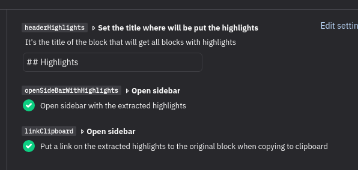

# Context
You can use this plugin to extrat highlights of the blocks and automatically:
- create a block of highlights
- or copy to clipboard

It helps when you want to use a workflow like: 
- [HQ&A](https://www.jamoe.org/note-taking)
- [Zettelkasten](https://learntrepreneurs.com/books-reading-better-learning-more/zettelkastens-3-note-taking-levels-help-you-harvest-your-thoughts/),
- [Progressive Summarization](https://fortelabs.co/blog/progressive-summarization-a-practical-technique-for-designing-discoverable-notes/)

## Inspiration and adaptation
This plugin is an adaptation of [logseq-psummarise-plugin](https://github.com/hkgnp/logseq-psummarise-plugin) from [@hkgnp](https://github.com/hkgnp) (kudos!). While I'm learning more about develop plugins, I've used part of the source code of that.

**Main differences** of this plugin from logseq-psummarise-plugin:
- focused on copy highlights (==), not 'bold' (\*\*)
- agnostic workflow: you can use with any workflow, instead of focusing on [Progressive Summarization](https://fortelabs.co/blog/progressive-summarization-a-practical-technique-for-designing-discoverable-notes/).
- allow to copy highlights to clipboard instead of create a block with highlights
- allow config the title of the block will get the highlights
- has a config to set to open or not on sidebar
- only work to copy highlights from blocks and its children
- show the highlighted text linked to block instead of show the text extracted of highlight and an asterik (\*) or other symbol with link on the side of the text.

# How to use
In any block, you can:
- Use the slash-command "/Highlights: Extract in a new block" or "/Highlights: Copy to clipboard"
- Click with the right button of mouse and select "Highlights: Extract in a new block" or "Highlights: Copy to clipboard".

# Settings

